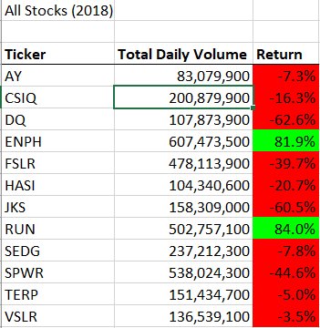

# Stock Analysis Using VBA and Excel

### Overview and Purpose
Using the combined powers of VBA and Excel, this project aims to analyze stock market data to help us understand the stocks that would be a good investment, and inversely which stocks have had a poor performance.  To do that, we will write a code that will pull two important factors that define a good stock: the total daily volume and yearly return. The total daily volume simply finds out how many times a certain stock was traded over a year. The yearly return of a stock is the percentage increase or decrease in the price of the stock. With these two important pieces of information, we can confidently make informed decisions on our investments.

Another unrelated purpose of this project is to understand the importance of refactoring old code and showing how efficient refactored code can be.
### Results
#### Stock Data Analysis

Looking at these two tables, we can clearly see that the stocks performed vastly differently between both years. 2017 was an amazing year for most of the stocks, whereas 2018 most drops suffered a negative return. Just looking at these two years isn't an adequate amount of information to truly understand if a stock is "good" or "bad." I recommend in future revisions to use as many years of data as possible to further increase our confidence in the performance of each stock, and to create a line chart comparing each stocks' yearly return.
#### Refactoring Timings

We can see that the new refactored code performs more quickly than the old code. However its unclear whether the change is significant. Running both codes yielded a varying amount of times.
### Summary
Refactoring old code can have many advantages, however there can be drawbacks as well.
#### Advantages
Properly refactoring old code can help someone new to the code deepen their understanding of how the code functions. Also as shown above, it can make code perform more efficiently.
#### Disadvantages
It can take a lot of time and labor cost to refactor a piece of code. Simply the cost may be greater than the overall benefit. Looking again at the pictures above, we can see that the new code was marginally faster than the old code. For short and simple code like this, its probably not worth the trouble to refactor. However for large projects with millions of lines of code, the time saved from refactoring could yield huge benefits.

